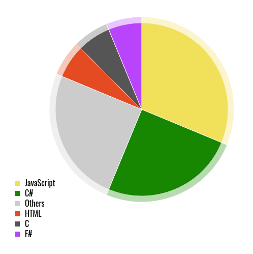

<h1 align="center">Hi 👋, I'm Melania</h1>
<h3 align="center">A creative front-end developer from Italy.</h3>
 

  <i>
    
      *Statistics may not include data from external organizations.
    
  </i>

<!--
https://github.com/anuraghazra/anuraghazra/blob/master/README.md
https://github.com/CircuitSacul/CircuitSacul/blob/main/README.md

---

<h3 align="left">Languages and Tools:</h3>

<code></code>
<code></code>
<code></code>
<code></code>

-->
